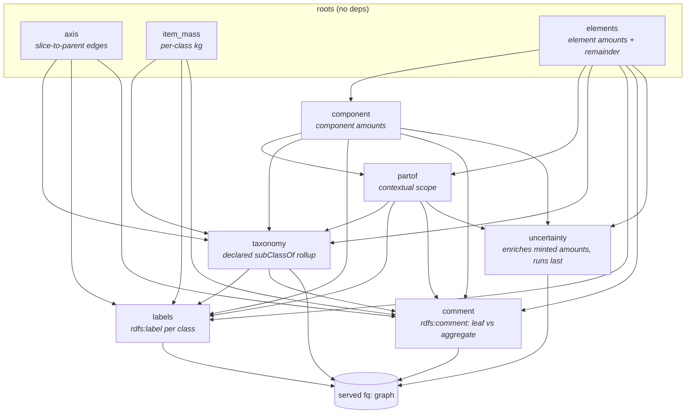

# Architecture

How the FutuRaM system is put together: the data flow, the builder and its
plugin resolver, the generic axis model, and the repository layout. For running
the system see the [root README](../README.md); for the served query vocabulary
see [`sparql-llm/README.md`](../sparql-llm/README.md); for how it is all tested
see [`tests/README.md`](../tests/README.md).

## Overview

The measured composition is stored in a rich, fully-referenced form: the
**baseline** ontology (`futuram:`), reified on instances. The **builder**
aggregates those measurements up to class-level estimates and projects them into
the **query-optimized** ontology (`fq:`), a flat vocabulary served over SPARQL
with a chat + MCP front end on top. The pipeline is RDF in, RDF out: the ETL
turns CSV/Excel into baseline composition RDF, and the builder turns that into
the served query-optimized graph. Neither hands the other anything but graphs.

```
CSV / Excel  --(etl: csv_to_rdf -> composition_rdf)-->  baseline composition RDF (futuram:, rich/reified)
                                                              |  builder: merge_sources -> derive_all
                                                              v
query-optimized graph (fq:, flat, <=2 hops)  ->  Fuseki  ->  MCP tool server  ->  LLM loop (run_bench)
   (committed in fuseki/futuram/data/query/)      :47040        :47898              driven from the :3737 UI
```

A separate **oracle** (`tests/oracle/`) is the frozen reference implementation of
the aggregation math. It is tests-only: the shipped library (`src/`) never
imports it. See [`tests/README.md`](../tests/README.md).

## The two vocabularies

The paper analyzes two cases of the same data. Each is a vocabulary with its own
SPARQL endpoint:

| paper's name | vocabulary | namespace | shape |
|---|---|---|---|
| **baseline** | the **composition statement** model (`futuram:`) | `https://www.purl.org/futuram#` | rich, reified on instances: provenance, QUDT/CEON quantities, uncertainty, multi-hop |
| **query-optimized** | the **`fq:`** view | `https://www.purl.org/futuram/query#` | flat, class-only projection of the builder's output, two hops or fewer |

Read it as: **composition statement = baseline**, **`fq:` = query-optimized**.
The `fq:` view is derived from the composition statements and links back to them
via `fq:derivedFrom`. A reader of the paper works with the two endpoints
(`/composition/sparql` and `/query/sparql`) and does not need the `fq:` internals;
the reference below is for developers extending the served view.

### The query pattern (query-optimized / `fq:`)

The query-optimized view answers "how much of constituent C is in class X" in one
pattern:

```sparql
PREFIX fq:      <https://www.purl.org/futuram/query#>
PREFIX futuram: <https://www.purl.org/futuram#>
PREFIX rdfs:    <http://www.w3.org/2000/01/rdf-schema#>

SELECT ?x ?amount WHERE {
  ?x fq:contains ?a .                       # ?x : a Product/Component/Material CLASS
  ?a fq:constituent futuram:Copper ;        # WHICH constituent (element/material/component)
     fq:amount      ?amount .               # best value, kg/kg  (the headline number)
  futuram:Copper rdfs:subClassOf futuram:Element .   # declare its KIND via the ontology
}
```

`fq:constituent` is level-neutral: the target may be an Element, Material, or
Component class. Its KIND is not encoded in the property name; you constrain it
via `rdfs:subClassOf futuram:Element` / `...Material` / `...Component`. (This
replaced the old level-specific `fq:element`; one property now covers every
level.)

Each `fq:Amount` node is one hop from the class (`fq:contains`) and carries the
value plus, where available, the uncertainty and provenance:

| on `fq:Amount` | meaning |
|---|---|
| `fq:constituent` | which constituent class the amount is about |
| `fq:whole` | back-link to the subject class (for constituent-first queries) |
| `fq:amount` | best value, kg/kg (the headline number) |
| `fq:unit` | `"kg/kg"` |
| `fq:relativeUncertainty` | relative uncertainty as a fraction (e.g. 0.20 is ±20%), derived from DQ indicators via the ruleset. Multiply by `fq:itemMass` and `fq:amount` for the absolute kg uncertainty of a concrete item |
| `fq:dqs` | mean data-quality score (0 to 1) feeding this amount's uncertainty derivation |
| `fq:unknownAmount` | unattributed residual of this constituent in this class |
| `fq:derivedFrom` / `fq:derivedFromStatement` | bridge back to the baseline composition statements |

On the class itself: `fq:contains` (the served edge); plus, for aggregates,
`fq:aggregationStrategy` and the generic slice edges `fq:sliceOf` (the
aggregation parent) and `fq:sliceAxis` (the axis/strategy IRI), one pair per axis
(year, drivetrain, and so on), with no per-axis predicate. Every class is
guaranteed to carry an `rdfs:label` (enforced by
`shapes/hierarchy-label-shapes.ttl`), so a plain-language term resolves to a class
and result IRIs can be labelled. The full vocabulary lives in the `fq:` query
TBox at `ontology/tbox/`; every served class carries an `rdfs:comment` noting
whether it is a directly-composed leaf or a derived aggregate.

## Key concepts

### The builder sees only RDF; the oracle is tests-only

`src/builder/` is pure RDF-in/RDF-out (`derive.py` is `merge_sources` +
`derive_all`, `store.py` is the incremental `add_source`); it never reads
CSV/YAML, walks a directory, or touches the ETL `doc` dict. The aggregation
oracle (`tests/oracle/`, the frozen reference) is imported by no `src` package;
`tests/test_builder_oracle_parity.py` pins the builder to it, and
`tests/test_layering.py` enforces all of these edges.

### Composition statements are the database; `fq:` is a derived view

The full one-shot derive (`etl.build_fq.build_global_fq` to `builder.derive`) is
the source of truth and the fast path. An incremental `add_source`
(`builder.store`) API exists for additivity: extend a view any time,
value-identical to a rebuild, though not faster for a large store.

### The resolver is a plugin DAG

The builder projects the composition graph into the served `fq:` graph by running
a DAG of resolver plugins (`src/builder/resolver/`). The `Resolver` engine knows
nothing about any individual plugin: each plugin declares a `name` and its `deps`
(other plugins whose output it reads), and the engine topologically sorts them
(cycles are an error) and unions their output into one graph. To add a served
angle you write one `Plugin` and drop it into `DEFAULT_PLUGINS`; there is no
engine change and no per-axis special-casing.



A plugin reads only `ctx` (shared compute-once state) and `upstream` (its deps'
merged output, which it must not mutate) and returns a graph. The contract that
makes the DAG safe, a plugin only ever sees the output of plugins it declared, is
enforced structurally, and every plugin is independently testable.

### Every axis is generic

Time and drivetrain are not special-cased. A slice carries
`futuram:sliceOf <parent>` + `futuram:sliceAxis <StrategyIRI>`. A year slice
`X_Y2026` rolls up to a timeless base `X` by `YearSliceMeanStrategy`.
Cross-drivetrain shared components carry a parallel drivetrain axis with the same
vocab: `elvBEV_elvElectricMotor_Y2030` and `elvHEV_elvElectricMotor_Y2030`
aggregate to `elvElectricMotor_Y2030` by `DrivetrainMeanStrategy` (BEV's motor is
not HEV's motor). Which classes belong to a drivetrain is data-driven: the ETL
marks them from `productKeyLevel1` and the builder's generic `ValueAxisSlicer`
reads the marker off the graph, with no folder/filename/axis hardcoding in the
builder.

### Default build years

The default build covers 2010/2020/2025/2030/2050 (discrete single-year slices,
what the benchmark loads). The source CSVs span 1980 to 2050, but the full
bucketed span is a separate, expensive build gated behind `--full-span` +
`BUILD_FULL_SPAN=i-really-mean-it`; a bare `build_instances` never starts it.

### RDF processing

Use `uv` + `rdflib`. No string/regex manipulation of ontology files (see
`CLAUDE.md`).

## Repository layout

The full directory-by-directory table lives in the
[root README](../README.md#repository-layout).
