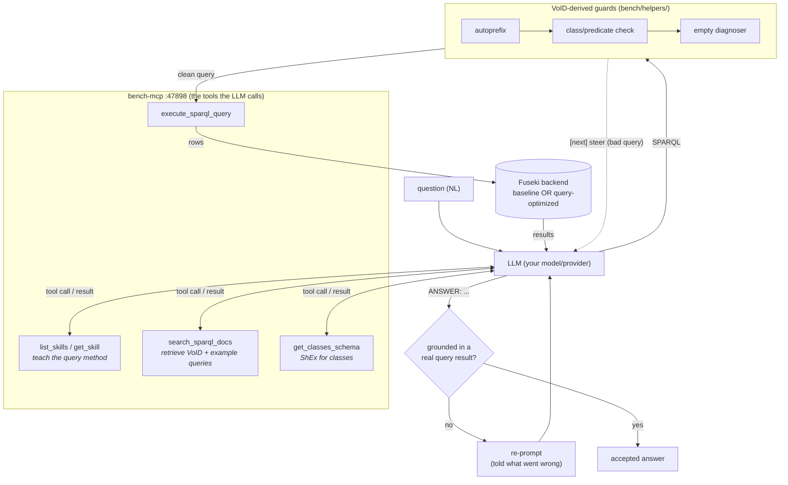

# sparql-llm integration: chat + MCP over the FutuRaM endpoints

Uses [sib-swiss/sparql-llm](https://github.com/sib-swiss/sparql-llm) to give an
LLM a chat + MCP interface over the two Fuseki SPARQL endpoints, taught the flat
`fq:` query vocabulary via local files.

> **In the normal stack you don't run anything here by hand.** `docker compose up`
> (from the repo root) builds the `futuram-sparql-llm` image and runs the MCP
> server as the `bench-mcp` container on `:47898`, with VoID generation and Qdrant
> indexing as one-shots before it. This README documents the pieces and how to run
> the server standalone. For the runtime, see the [root README](../README.md).

## Files here

| file | role |
|---|---|
| `settings.json` | points sparql-llm at the served endpoints + the teaching files |
| `futuram_examples.ttl` | example SPARQL queries (SHACL form) the agent retrieves to learn the `fq:` pattern |
| `futuram_void.ttl` | the schema the LLM sees, generated (not hand-written) by `scripts/gen_void.py` from the actual served `/query` graph |

### Generated VoID (no hardcoding)

`futuram_void*.ttl` are the **output of a program**, not hand-authored:
`scripts/gen_void.py <data/query dir>` loads every `*.ttl` the Fuseki entrypoint
loads and introspects it: for each subject `rdf:type` it lists the predicates
used and, per predicate, the object class(es)/datatype(s). No class or property
IRI is hardcoded. The thousands of per-(drivetrain, component, year) **slice
classes** (`elv..._Y2029`) are detected from the data (subjects of `fq:sliceOf` /
`fq:sliceAxis` / `fq:referenceYear` / `fq:periodStart`/`End`) and collapsed into
ONE "aggregation-slice classes" chapter with a `void:entities` count, so the real
query vocabulary stays visible.

In compose this runs automatically as the `void-gen` one-shot (after the served
graph is materialised, before the indexer). To regenerate by hand:

```sh
uv run scripts/gen_void.py fuseki/futuram/data/query -o sparql-llm/futuram_void.ttl
```

### ChEBI + Metal-Wheel overlay

The futuram `/query` graph carries a second vocabulary (Reuter et al. 2019): a
ChEBI element/compound module + the Metal-Wheel recovery model + EU criticality
flags, keyed on ChEBI IRIs and bridged to the `fq:` element by `skos:altLabel`.
Sources live in `ontology/sources/` (no legacy dependency); the `chebi-extract`
compose one-shot rebuilds them on every `up` via ROBOT
(`scripts/extract_chebi_module.sh`) into `fuseki/futuram/data/query/`. Example
queries: `elementByName`, `recoverabilityOfElement`, `criticalElements`,
`recoverabilityOfProductElement`.

## Running the MCP server standalone

The MCP server reads from a Qdrant index of the VoID + examples
(`SparqlExamplesLoader` + `SparqlVoidShapesLoader` over the files named in
`settings.json`). In the stack, the `bench-vectordb` (Qdrant) and `bench-indexer`
containers provide and populate that index. To run the server outside the stack
you need the endpoints up (`docker compose up -d` serves them at `:47040`) and a
Qdrant index built, then:

```sh
# stdio (for an MCP client like Claude / VS Code)
SETTINGS_FILEPATH=sparql-llm/settings.json uvx sparql-llm

# or HTTP
SETTINGS_FILEPATH=sparql-llm/settings.json uvx sparql-llm --http --port 8888
```

MCP client config (e.g. VS Code `mcp.json`):

```json
{
  "servers": {
    "futuram": {
      "type": "stdio",
      "command": "uvx",
      "args": ["sparql-llm"],
      "env": { "SETTINGS_FILEPATH": "sparql-llm/settings.json" }
    }
  }
}
```

## The harness and the tools it exposes

This MCP server is the tool layer the LLM works through. The benchmark harness
(`bench/run_bench.py`, see [`bench/README.md`](../bench/README.md)) connects to it
as an MCP client, points it at one backend's endpoint, and loops: the model
learns the query method from the skills, searches the docs, writes SPARQL, and
the harness runs it through the VoID guards before it reaches Fuseki. An answer
counts only when it was grounded in a real query result.

The two backends are the paper's two cases of the same data:

| backend | endpoint | the paper's name |
|---|---|---|
| composition statements | `/composition/sparql` | **baseline** |
| `fq:` | `/query/sparql` | **query-optimized** |

The tools available to the model:

| tool | what it does |
|---|---|
| `search_sparql_docs` | retrieve example queries + VoID shapes from the Qdrant index (the `fq:` teaching) |
| `get_classes_schema` | the ShEx schema for classes on the endpoint |
| `execute_sparql_query` | run SPARQL against the selected endpoint |
| `list_skills` / `get_skill` | the how-to skills that teach the query method (enabled with `--skills`) |



The VoID guards wrap each `execute_sparql_query`. They read only the endpoint's
VoID and never hardcode an answer, so they catch a typo or the wrong backend's
vocabulary without ever blocking a valid query:

| guard (`bench/helpers/`) | what it does |
|---|---|
| `autoprefix` | fills a missing `PREFIX` and corrects a wrong namespace (e.g. `http://.../futuram#` to the canonical `https://www.purl.org/futuram#`) |
| `classcheck` / `predicatecheck` | block a query naming a class/predicate absent from both the VoID and the live data, with hints; a valid query is never blocked |
| `emptydiagnoser` | on a zero-row result, pinpoints the triple/join/FILTER that emptied it |
| feedback guarantee | every tool turn returns real data or an actionable `[next]` steer, and points the model at its skills |

Each backend runs independently with the same question and the same tools; the
only difference is which endpoint the model queries. The scoring, timing, and
token accounting are documented in [`bench/README.md`](../bench/README.md).

## What the LLM learns

The query-optimized (`fq:`) model is flat and class-only, so one pattern answers
everything. The constituent's KIND comes from the ontology (`rdfs:subClassOf` to
one of `futuram:Product/Component/Material/Element`), not a flat marker:

```sparql
?class fq:contains [ fq:constituent ?e ; fq:amount ?v ] .
?e rdfs:subClassOf futuram:Element .   # or Component / Material
```

Every class is guaranteed to carry an `rdfs:label` (enforced by
`shapes/hierarchy-label-shapes.ttl`, severity `sh:Violation`), so the LLM can rely
on labels for two things: **resolving** a user's plain-language term to a class
IRI, and **labelling** result IRIs so answers read in names, not opaque IRIs:

```sparql
# name -> class IRI (the label lookup always succeeds for any class)
?class a owl:Class ; rdfs:label ?label .
FILTER(CONTAINS(LCASE(STR(?label)), "electricmotor"))
```

### kg/kg fractions vs absolute kg: `fq:itemMass`

Composition amounts (`fq:amount`) are **kg/kg fractions** (per 1 kg of the class).
To get an **absolute** mass, multiply by the class's `fq:itemMass`, the absolute
kilograms of ONE item of that Product/Component class (the reference anchor):

```sparql
# absolute kg of an element in one item  =  itemMass × fraction
?class fq:itemMass ?kgPerItem ; fq:contains [ fq:constituent ?e ; fq:amount ?frac ] .
BIND(?kgPerItem * ?frac AS ?absoluteKg)
```

`fq:itemMass` is **derived per class** from the instances by the class's
aggregation strategy (a measured instance value wins; otherwise the strategy's
`futuram:massAggregation` facet decides: mean over year/drivetrain slices, or sum
over composition parts). Because instances are typed into year slices, a
component's `fq:itemMass` **differs by year** (its `_Y<year>` slices), so the mass
trend over time is queryable.

`futuram_examples.ttl` teaches several patterns. The composition ones are
copper-in-a-product, elements-in-a-product, component/material mass fractions,
the unattributed remainder (a first-class `futuram:unknown*` constituent row,
where each level's amounts sum to 1.0), and the `partOf` contextual scope.
Leaning on the label guarantee, it also teaches name-to-class-IRI resolution
(`ex:classByName`) and labelled results (`ex:labelledConstituents`). For absolute
masses it teaches `ex:itemMassOfClass`, `ex:absoluteAmountFromFraction` (itemMass
times fraction), and `ex:itemMassByYear` (per-year mass differences for a
component).
