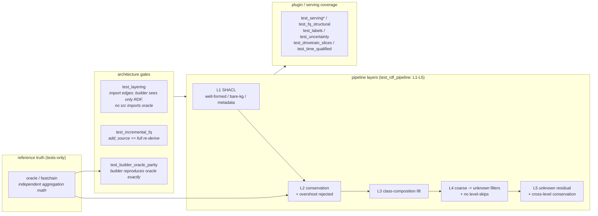

# Testing

How the pipeline and the plugin resolver are tested. Numbers in this project are
never hand-typed into a test: correctness is pinned against an independent
oracle, the architecture is enforced by static import checks, and the SHACL gate
guards every graph that gets aggregated. The suite (`tests/`, ~32 test modules)
layers like this:



## The oracle principle

`tests/oracle/` is a Python model of a supply chain (`fastchain/`, with
`supplychain.py` a thin facade over it). From a scenario description it computes
the ground truth, conservation sums, coarse-vs-granular totals, and the
quantified unknown, so no test asserts a hand-typed number.
`test_builder_oracle_parity.py` pins the shipped builder to those numbers;
`test_golden_oracle.py` and `test_fastchain.py` freeze the oracle's own
arithmetic against a captured reference.

## Architecture is enforced, not just documented

`test_layering.py` parses the import graph of `src/` and fails if `builder`
imports `etl`/`oracle`/`poc`, if anything under `src/` imports the oracle, or if
`common` reaches up into a higher layer. So "the builder sees only RDF" and "the
oracle is tests-only" are checked mechanically.
`test_incremental_fq.py::test_increment_equals_full_derive` asserts an
incremental `add_source` is value-identical to a full re-derive.

## The pipeline is tested in layers (L1-L5)

`tests/test_rdf_pipeline.py` runs every scenario through the real pipeline and
checks each layer against the oracle: L1 SHACL well-formedness (and that bare-kg
and missing-metadata graphs are rejected), L2 mass conservation and overshoot
rejection, L3 the class-composition lift, L4 coarse statements getting `unknown*`
fillers with no level-skips, and L5 the unattributed residual plus cross-level
conservation. Per-test specifications for the L1-L2 layers live in
[`specs/`](specs/README.md).

## The plugin DAG and the served view

Each resolver plugin's output is covered by the serving tests (`test_serving*.py`,
`test_fq_structural.py`), `test_labels.py` (the label guarantee),
`test_uncertainty.py` and `test_si_uncertainty.py` (the uncertainty ruleset
reproduces the SI tables), `test_drivetrain_slices.py` and `test_time_qualified.py`
(the generic axes), and `test_context_independence.py` (a plugin only sees its
declared deps). `test_si_competency.py` regresses the paper's competency questions
end-to-end. The plugin DAG itself is described in
[`docs/architecture.md`](../docs/architecture.md).

## The SHACL gate

`src/common/pipeline.py` `validate()` is the always-on first line: it RDFS-closes
a copy of the graph and runs the `shapes/` constraints; a non-conforming graph is
never aggregated. The optional ROBOT/ELK consistency check (see
[`consistency/README.md`](../consistency/README.md)) is the second line, for
logical contradictions.

## Running the suite

```sh
uv run --with pytest --with pyyaml --with pyshacl --with rdflib \
  --with pandas --with openpyxl --with requests --with polars --with owlrl \
  python -m pytest tests/ -v --tb=line          # fast suite (slow CSV tests deselected)
uv run ... python -m pytest tests/ -v --tb=line -m slow   # the heavy real-CSV end-to-end tests
```

`--with polars` is required: omitting it silently skips the SI
competency/uncertainty tests (they use `importorskip`), giving a misleading green.
